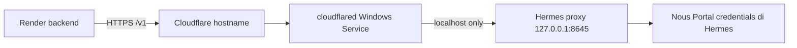

# Hermes melalui Cloudflare Tunnel

Dokumen ini menjelaskan jalur publik untuk Hermes Agent lokal dan mekanisme pemulihan
setelah Windows restart.

## Arsitektur



## Kondisi lokal yang sudah diverifikasi

- `cloudflared` terpasang sebagai service Windows `Cloudflared`.
- Service menggunakan token file di `C:\ProgramData\cloudflared\token` dan bukan
  `C:\Users\Kuda\.cloudflared\config.yml`. Jangan mengedit atau mencetak token tersebut.
- Cloudflared memakai metrics/ready endpoint lokal `http://127.0.0.1:20241/ready`.
- Hermes OpenAI-compatible API menggunakan `hermes.exe proxy start` pada
  `http://127.0.0.1:8645/v1`.
- Origin tetap bind ke loopback; hanya Cloudflare Tunnel yang boleh meneruskannya ke luar.

## Autostart dan recovery

Supervisor `ops/hermes/hermes-proxy-supervisor.ps1` menjaga port 8645 tetap aktif.
Installer membuat Scheduled Task pada saat user login, sehingga profile Hermes dan
credential Nous Portal tersedia tanpa menaruh credential di repository.

Jalankan PowerShell sebagai user yang memiliki Hermes:

```powershell
Set-ExecutionPolicy -Scope Process Bypass
& .\ops\hermes\install-hermes-autostart.ps1
```

Validasi lokal:

```powershell
& .\ops\hermes\validate-hermes-tunnel.ps1
```

Log supervisor berada di `%LOCALAPPDATA%\hermes\logs\proxy-supervisor.log`.

Untuk menghapus Scheduled Task:

```powershell
& .\ops\hermes\install-hermes-autostart.ps1 -Uninstall
```

## Public Hostname Cloudflare

Karena service yang ada memakai token-managed tunnel, route hostname harus ditambahkan
di Cloudflare Zero Trust pada tunnel yang sama, bukan dengan mengubah `config.yml` lokal.

Tambahkan Public Hostname berikut:

| Field | Nilai |
|---|---|
| Hostname | `hermes.ninetyfour.fun` |
| Type | `HTTP` |
| URL | `http://127.0.0.1:8645` |

Setelah disimpan, jalankan:

```powershell
& .\ops\hermes\validate-hermes-tunnel.ps1 -PublicBaseUrl https://hermes.ninetyfour.fun
```

### DNS domain saat ini

Pada audit awal 13 Agustus 2026, `hermes.94media.art` belum memiliki record DNS. Route
yang kemudian berhasil divalidasi adalah `hermes.ninetyfour.fun`; gunakan hostname ini
untuk konfigurasi Render.

Pilih salah satu jalur berikut:

1. Jika tetap memakai DNS provider saat ini, buat record `CNAME` bernama `hermes` yang
   menunjuk ke tunnel subdomain `<TUNNEL-UUID>.cfargotunnel.com`, lalu pastikan Public
   Hostname pada tunnel yang sama memakai origin `http://127.0.0.1:8645`.
2. Jika zone `94media.art` sudah ditambahkan ke akun Cloudflare, ubah nameserver pada
   registrar ke nameserver Cloudflare yang diberikan akun tersebut. Setelah propagasi,
   buat Public Hostname di Dashboard; Cloudflare akan membuat CNAME tunnel secara otomatis.

Jangan menebak `<TUNNEL-UUID>` dari tunnel lain. Gunakan tunnel yang sama dengan service
`Cloudflared` yang saat ini menghasilkan `readyConnections=4`. Jangan membuat tunnel baru
atau mengganti token hanya untuk memperbaiki DNS.

Jika hostname belum dibuat, hasil public check harus gagal dengan `DNS_NOT_CONFIGURED`;
local Hermes dan Cloudflared ready check tetap harus `OK`.

## Render

Isi environment variables backend Render setelah public route lulus validasi:

```text
HERMES_AGENT_ENABLED=true
HERMES_AGENT_BASE_URL=https://hermes.ninetyfour.fun/v1
HERMES_AGENT_API_KEY=<nilai bearer yang diizinkan Hermes proxy>
HERMES_AGENT_MODEL=upstage/solar-pro4:free
HERMES_AGENT_TIMEOUT_MS=120000
```

Jangan commit nilai `HERMES_AGENT_API_KEY`. Untuk keamanan tambahan, pasang Cloudflare
Access/service token atau pembatasan jaringan sebelum hostname dipakai dari internet.

## Uji pemulihan

1. Pastikan `validate-hermes-tunnel.ps1` menunjukkan tiga check `OK`.
2. Reboot Windows pada waktu yang aman.
3. Setelah login, tunggu 30--60 detik.
4. Jalankan kembali validator lokal dan public.
5. Periksa Task Scheduler dengan task name `94media Hermes API Supervisor` dan
   `sc.exe query Cloudflared`.

Cloudflare Tunnel dapat berstatus sehat sementara origin lokal masih mati; karena itu
validasi harus mengecek kedua sisi: `cloudflared /ready` dan `/v1/models` Hermes.

## Catatan recovery Cloudflared

Jalankan script berikut sekali dari PowerShell **Run as administrator** pada PC yang
menjalankan tunnel:

```powershell
& .\ops\hermes\configure-cloudflared-recovery.ps1
```

Script mengatur delayed-auto dan restart bertahap ketika proses gagal. Kegagalan koneksi
jaringan biasanya pulih melalui retry connector; jika service benar-benar mati, Windows
Service Recovery menjalankannya kembali. Tidak perlu membuat tunnel baru.
